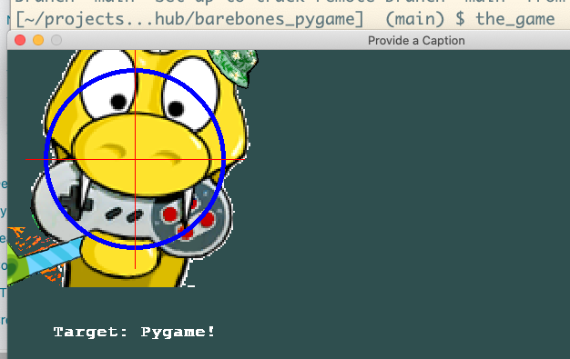

# barebones pygame

Describe how to stand up a simple pygame project.

## General notes


## setting up once...

```
mkdir barebones_pygame
cd barebones_pygame/
pyenv local 3.6.8
virtualenv virtualenv
mkdir src
cd src
mkdir game
cd game
touch __init__.py
vi __main__.py
vi game.py
mkdir resources
cd ../..
vi .gitignore
touch README.md
vi setup.py
venv
cd src/game
python __main__.py
cd ../..
pip freeze > requirements.txt
git init
pip install -r requirements.txt
pip install -e .
pip install -e .
the_game

```

